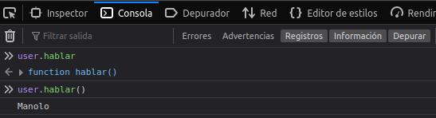

# DWEC UT02: Estructura de objetos predefinidos y objetos definidos por el usuario.

## Que son los objetos

Como ya hemos visto, hay diferentes tipos de datos que podemos definir para variables, se llaman "primitivos", porque sus valores contienen sólo una cosa (ya sea una cadena, un número o lo que sea). El tipo de dato `object` es tambien considerado primitivo.

Los objetos se utilizan para almacenar colecciones con una clave asociada a diversos datos y entidades más complejas. En JavaScript, los objetos penetran en casi todos los aspectos del lenguaje. Por eso debemos entenderlos primero antes de profundizar en ningún otro lugar.

Se puede crear un objeto con corchetes `{…}` con una lista opcional de propiedades. Una propiedad es un par `clave: valor`, donde la clave es una cadena (también llamada “nombre de propiedad”) y el valor puede ser cualquier cosa.

```js
const objeto = {};    // Esto es un objeto vacío

const objeto2 = new Object(); // Esta forma tambien seria correcta
```

En Javascript, siempre que podamos, se prefiere utilizar la **notación literal**, una forma abreviada para crear objetos (u otros tipos de datos) sin utilizar la palabra `new`

```js
let usuario = {       // definimos un objeto
  nombre: "Manolo",   // propiedad con clave "nombre" y valor "Manolo"
  edad: 28            // propiedad con clave "edad" y valor "28"
};
```

Estas propiedades pueden ser accedidas/modificadas/borradas de 2 formas distintas:

```js
console.log(`Tu nombre es ${usuario.nombre} y tienes ${usuario.edad} años`)

console.log("Te llamas: " + usuario["nombre"])
```

La más utilizada en Javascript suele ser la notación con puntos, mientras que la notación con corchetes se suele conocer en otros lenguajes como «arrays asociativos» o «diccionarios».

> #### *Tener en cuenta que ...*
> Hay ciertos casos en los que sólo se puede utilizar la notación con corchetes, como por ejemplo cuando s**e utilizan espacios en el nombre de la propiedad**. Es imposible hacerlo con la notación con puntos.
> ```js
> console.log(usuario.nombre completo);     //no sería correcto
> console.log(usuario["nombre completo"]);  //si sería correcto
> ```

### Añadir propiedades

También podemos añadir propiedades al objeto después de haberlo creado, y no sólo en el momento de crear el objeto:

```js
let usuario = {};

usuario.nombre = "Manolo";
usuario.edad = 28;
// utilizando los corchetes
usuario["nombre"] = "Jeronimo";
usuario["edad"] = 45;
```
### Borrar propiedades

Para borrar una propiedad de un objeto utilizamos el operador `delete` de la siguiente manera:

```js
...
console.log(usuario);     // Object { nombre: "Manolo", edad: 28 }
delete usuario.edad;
console.log(usuario);     // Object { nombre: "Manolo" }
```

### Metodos

Hasta ahora, solo hemos visto como crear objetos «genéricos». También hemos visto que es posible añadir propiedades a un objeto, que no son más que variables dentro del objeto en cuestión.

Si dentro de una variable del objeto metemos una función (o una variable que contiene una función), tendríamos lo que se denomina un método de un objeto:

```js
const usuario = {
  nombre:"Manolo",
  saludar: function(){
    console.log(`Hola! Mi nombre es ${nombre}`)
  }
}
usuario.hablar()
```

Si alguien ya tiene experiencia en el mundo de la programación, esto le resultará muy similar al concepto de "Clase".

### Metodos heredados

Simplemente por generar una variable de tipo `object`, esa variable «hereda» una serie de métodos que existen en cualquier variable que sea de tipo `object`. Un buen ejemplo, sería el método ".toString()", un método que intenta representar la información de ese objeto en un `string`.

```js
const usuario = {
  nombre:"Manolo",
  saludar: function(){
    console.log(`Hola! Mi nombre es ${nombre}`)
  }
}
usuario.toString()      // Devuelve "[object Object]"
                        // (representación textual de un objeto genérico)
```
En ningún momento hemos añadido una función .toString() al objeto, pero aún así existe y la podemos ejecutar.

> #### *Tener en cuenta que ...*
> Cuando utilizamos el nombre de la propiedad nos devuelve el valor de ésta en caso de ser un tipo de dato primitivo. En caso de una función sera `function`. Si queremos ejecutar ese metodo, tenemos que poner los `()`:
> <p align="center"> 
> 
> </p>

Esto ocurre también con otros tipos de dato que a priori no son `object`, por ejemplo `number` o `boolean`:

```js
const numero = 42;      // Tipo Number
number.toString();      // Devuelve "42"

const booleano = true;  // Tipo Boolean
booleano.toString();    // Devuelve "true"
```

Podemos sobreescribir metodos que vienen heredados. En este caso si queremos llamar al metodo `toString()` de nuestro objeto creado, podríamos hacerlo de la siguiente manera:

```js
const usuario = {
  nombre:"Manolo",
  edad: 28
  toString: function(){
    return `Mi nombre es ${this.nombre} y tengo ${this.edad} años.`
  }
}

usuario.toString()      // "Mi nombre es Manolo y tengo 28 años." 
```