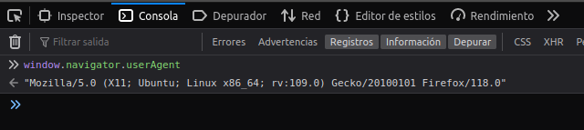
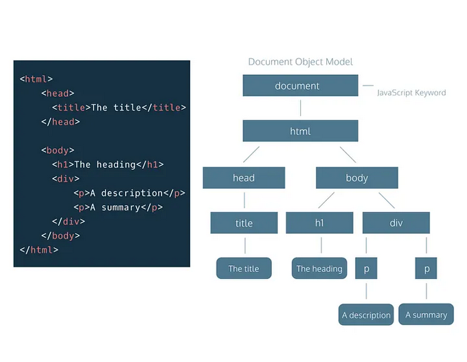

# DWEC UT02: Estructura de objetos predefinidos y objetos definidos por el usuario.

## Objetos predefinidos en JavaScript

El lenguaje JavaScript se creó inicialmente para navegadores web. Desde entonces, ha evolucionado hasta convertirse en un lenguaje con muchos usos y plataformas.

Una plataforma puede ser un navegador, un servidor web u otro host, o incluso una máquina de café "inteligente" si puede ejecutar JavaScript. Cada uno de estos proporciona una funcionalidad específica de la plataforma.

Un entorno anfitrión proporciona sus propios objetos y funciones además del núcleo del lenguaje. Los navegadores web brindan un medio para controlar las páginas web, asi como "NodeJS" brindan un caracteristicas del lado del servidor, etc.

Aquí hay una vista general de lo que tenemos cuando JavaScript se ejecuta en un navegador web:
<p align="center"> 

</p>

Hay un objeto raiz llamado `window` que cumple 2 funciones principales:
* Es un objeto global para el codigo de JavaScript, es decir, provee de variables y metodos que estan disponibles para usar en cualquier parte del código.
* Representa la ventana del navegador y provee metodos y propiedades para controlarla.

## BOM
El modelo de objetos del navegador (BOM) representa objetos adicionales proporcionados por el navegador para trabajar con todo a parte del objeto `document`.

### Gestionando ventanas

Un script no creará nunca la ventana principal de un navegador. Pero sin embargo, un script que esté ejecutándose en una de las ventanas principales del navegador, si que podrá crear o abrir nuevas sub-ventanas.

El método que genera una nueva ventana es `window.open()`. Este [método](https://developer.mozilla.org/en-US/docs/Web/API/Window/open) contiene hasta tres parámetros, que definen las características de la nueva ventana: la URL del documento a abrir, el nombre de esa ventana y su apariencia física (tamaño, color,etc.).

Por ejemplo, si consideramos la siguiente instrucción que abre una nueva ventana de un tamaño determinado y con el contenido de un documento HTML:

```js
let subVentana = window.open("nueva.html", "nueva", "height=800, width=600");
```

Una vez creada la ventana nueva, a través de las propiedades y los metodos podremos controlar/configurar esta nueva ventana desde el script principal. Recordad las limitaciones de JS del primer tema, no podemos controlar otras ventanas de ningún otro navegador pero si las que hemos creado desde nuestro script.

Las funciones `alert | confirm | prompt` también forman parte del BOM: no están directamente relacionadas con `document`, sino que representan métodos puros del navegador para comunicarse con el usuario.

> Puedes encontrar todas las propiedades y metodos del objeto `window` en este enlace de MDN Mozilla ([enlace](https://developer.mozilla.org/en-US/docs/Web/API/Window)).

### Objeto `location`

El objeto `location` de JavaScript es una interfaz incorporada (tipo de objeto) que representa la ubicación (URL) del objeto al que está adjunto. Tanto el objeto `window` como el objeto `document` tienen esta propiedad. 

```js
console.log(window.location.href);   //Podemos acceder al objeto como propiedad de windows
console.log(location.href);          //también directamente a través de el propio objeto
...
if (confirm("Quieres visitar wikipedia?")) {
  location.href = "https://wikipedia.org"; // redirige la pagina a la URL especificada
}
```

> Puedes encontrar todas las propiedades y metodos del objeto `location` en este enlace de MDN Mozilla ([enlace](https://developer.mozilla.org/en-US/docs/Web/API/Location)).

### Objeto `navigator`

La interfaz `navigator` representa el estado y la identidad del navegador. Permite a los scripts consultarlo y registrarse para realizar algunas actividades.

Se puede acceder al objeto `navigator` utilizando la propiedad de solo lectura del objeto `window`.

<p align="center"> 

</p>

> Puedes encontrar todas las propiedades y metodos del objeto `navigator` en este enlace de MDN Mozilla ([enlace](https://developer.mozilla.org/en-US/docs/Web/API/Navigator)).

### Objeto `screen`

El objeto `screen` representa una pantalla, generalmente aquella en la que se representa la ventana actual, y se obtiene usando la propiedad `window.screen` o accediendo directamente al objeto `screen`.

Tenga en cuenta que los navegadores determinan la pantalla actual detectando qué pantalla tiene el centro de la ventana del navegador.

```js
console.log(`La resolución de tu pantalla es de ${screnn.height}x${screen.width} pixeles`)
```

> Puedes encontrar todas las propiedades y metodos del objeto `screen` en este enlace de MDN Mozilla ([enlace](https://developer.mozilla.org/en-US/docs/Web/API/Screen)).

## DOM
El modelo de objetos de documento, o "DOM" para abreviar, representa todo el contenido de la página en forma de objetos que se pueden controlar y modificar.

El objetivo de `document` es servir de  "punto de entrada" a la página. Podemos cambiar o crear cualquier cosa en la página utilizando este objeto.

Por ejemplo:
```js
// cambiar el fondo de la página de color.
document.body.style.background = "red";

// poner un temporizador para cambiar de color el fondo.
setTimeout(() => document.body.style.background = "", 1000);
```
Una página HTML está formada por múltiples etiquetas HTML, anidadas una dentro de otra, formando un árbol de etiquetas relacionadas entre sí, que se denomina árbol DOM (o simplemente DOM).

<p align="center"> 

</p>

### Accediendo a elementos del DOM

En Javascript, la forma de acceder al DOM es a través del objeto `document`, que representa el árbol DOM de la página o, más concretamente, la página de la pestaña del navegador donde nos encontramos. En su interior pueden existir varios tipos de elementos, pero principalmente serán `element` o `node` :

* `element` no es más que la representación genérica de una etiqueta: "HTMLElement".
* `node` es una unidad más básica, la cuál puede ser `element` o un **nodo de texto**.

En temas posteriores veremos que Javascript nos proporciona un conjunto de herramientas para trabajar de forma nativa con el DOM de la página, entre las que se encuentran:

* Buscar etiquetas
* Crear etiquetas
* Gestionar atributos
* Gestionar CSS
* Insertar etiquetas
* Navegar por etiquetas

Por el momento nos centraremos en la **busqueda de etiquetas** y la gestión de atributos básicos de éstas.

### Busqueda de etiquetas

Si nos encontramos en nuestro código Javascript y queremos hacer modificaciones en un elemento de la página HTML, lo primero que debemos hacer es buscar dicho elemento. Para ello, se suele intentar identificar el elemento a través de alguno de sus atributos más utilizados, generalmente el `id` o `class`.

Existen una serie de métodos que nos permitirán buscar en el DOM de la página y encontrar dichos elementos. El primer grupo son métodos más antiguos y tradicionales, el segundo grupo son métodos más modernos

### *Metodos tradicionales*

os métodos más clásicos y tradicionales para realizar búsquedas de elementos en el DOM son más sencillos, pero menos potentes. Si lo que buscas es un elemento específico, lo mejor sería utilizar el método getElementById(). En caso contrario, utilizaremos alguno de los otros tres métodos, que nos devuelven siempre un `array`:

| Método de búsqueda | Descripción | Si no lo encuentra... |
|----------|----------|-----------|
|  `.getElementById(id)` | Busca el elemento HTML por su `id` | Devuelve `null` |
|  `.getElementsByClassName(class)` | Busca elementos con la clase `class` |  	Devuelve `[]` |
 `.getElementsByName(value)` | Busca elementos con el atributo `name` a `value` | Devuelve `[]` |
|  `.getElementsByTagName(tag)` | Busca etiquetas HTML tag. | Devuelve `[]` |

#### getElementById()

El primer método, `.getElementById(id)` busca un elemento HTML con el **id** especificado. En principio, un documento HTML bien construído no debería tener más de un elemento con el mismo *id*, por lo tanto, este método devolverá siempre un solo elemento:

```js
let  seccion = document.getElementById("seccion");   // <div id="seccion"></div>
```

#### getElementByClassName()

Por otro lado, el método `.getElementsByClassName(class)` permite buscar los elementos que tengan la clase especificada en class. Es importante darse cuenta del matiz de que el método tiene **getElements** en plural, es decir, puede devolver varias clases ya que al contrario que los id, pueden existir varios elementos con la misma clase:

```js
const elementos = document.getElementsByClassName("container");  // [div, div, div]

console.log(items[0]);      // Primer elemento encontrado: <div class="container"></div>
console.log(items.length);  // 3
```

> #### *Tener en cuenta que ...*
> Estos métodos devuelven siempre un `array` con todos los elementos encontrados que encajen con el criterio. En el caso de no encontrar ninguno, devolverá un vacío: `[]`.

Exactamente igual funcionan los métodos `getElementsByName(name)` y `getElementsByTagName(tag)`, salvo que se encargan de buscar elementos HTML por su atributo `name` o por su propia `etiqueta` de elemento HTML, respectivamente:

```js
// Obtiene todos los elementos con atributo name="nickname"
let nicknames = document.getElementsByName("nickname");  // [input]

// Obtiene todos los elementos <div> de la página
let divs = document.getElementsByTagName("div");         // [div, div, div]
```

### *Metodos modernos*

Aunque los métodos tradicionales anteriores son más suficiente para buscar elementos, actualmente tenemos a nuestra disposición dos nuevos métodos de búsqueda de elementos que son mucho más cómodos y prácticos si conocemos y dominamos los selectores CSS.

| Método de búsqueda | Descripción | Si no lo encuentra... |
|----------|----------|-----------|
|  `.querySelector(sel)` | Busca el primer elemento que coincide con el selector CSS `sel` | Devuelve `null` |
|  `.querySelectorAll(sel)` | usca el primer elemento que coincide con el selector CSS `sel` |  	Devuelve `[]` |
 
#### querySelector()

El método `.querySelector()` devuelve el primer elemento que encuentra que encaja con el selector CSS suministrado por parámetro. Siempre devuelve un solo elemento y en caso de no coincidir con ninguno, devuelve  `null` :

```js
const page = document.querySelector("#page");               // <div id="page"></div>
const info = document.querySelector(".main .info");         // <div class="info"></div>
```

* El primer ejemplo sería equivalente a utilizar un `.getElementById()`, sólo que en la versión de `.querySelector()` indicamos por parámetro un "selector", y en el primero le pasamos un simple "string". Observa que estamos indicando un `#` porque se trata de un `id`.

* En el segundo ejemplo, estamos recuperando el primer elemento con clase `info` que esté dentro de otro con clase `main`. En los métodos tradicionales, sería menos directo ya que tendríamos que realizar varias llamadas. Con `.querySelector()` se hace directamente sólo con una.

#### querySelectorAll()

Por otro lado, el método `.querySelectorAll()` realiza una búsqueda de elementos en el DOM, sólo que como podremos intuir por ese All(), devuelve un `array` con todos los elementos que coinciden con el "selector" CSS.

```js
// Obtiene todos los elementos con clase "info"
const infos = document.querySelectorAll(".info");

// Obtiene todos los elementos con atributo name="nickname"
const nicknames = document.querySelectorAll('[name="nickname"]');

// Obtiene todos los elementos <div> de la página HTML
const divs = document.querySelectorAll("div");
```

El método `.querySelectorAll()` siempre nos devolverá un `array` de elementos. El número de elementos del array dependerá de los que encuentre.

### Busquedas acotadas

Al realizar una búsqueda de un elemento particular y guardarlo en una variable o constante, podemos volver a realizar una nueva búsqueda posteriormente sobre este elemento, en lugar del DOM íntegro `document`:

```js
const menu = document.querySelector("#menu");
const links = menu.querySelectorAll("a");
```

En este caso podríamos resumir esto en una sola línea:

```js
const links = document.querySelectorAll("#menu a");
```

> #### *Tener en cuenta que ...*
> Aunque en esta documentación hemos hablado de `array` (para simplificar), realmente los métodos de búsqueda generalmente devuelven un tipo de dato `HTMLCollection` o `NodeList`, que aunque son muy similares, no son exactamente lo mismo. Pero esto lo veremos mas adelante.

### Modificando contenido de elementos

Si tenemos elementos HTML y queremos modificar su contenido, podemos hacerlo desde Javascript desde ciertas propiedades de elementos del DOM. Estas propiedades son muy útiles tanto para obtener información, para modificarla, así como para eliminarla. Vamos a analizar como podemos hacerlo.

Antes de empezar imáginemos que tenemos el siguiente código HTML:

```html
<div class="contenedor">
  <div class="padre">
    <p>Saludos a todos.</p>
    <p class="mensaje">Mi nombre es <strong>Manolo</strong>.</p>
  </div>
</div>
```

Vamos a seleccionar el elemento `<p>` con clase `.message` desde Javascript y a trabajar con él accediendo a varias de sus propiedades. Las propiedades básicas a las que vamos a acceder son las siguientes:

| Propiedades  | Descripción |
|----------|----------|
|  `string` .nodeName | Devuelve el nombre del nodo (etiqueta si es un elemento HTML). Sólo lectura. |
|   `string` .textContent | Devuelve el contenido de texto del elemento. Se puede asignar para modificar. |
|   `string` .innerHTML | Devuelve el contenido HTML del elemento. Se puede usar asignar para modificar. |
|   `string` .outerHTML | Idem a .innerHTML pero incluyendo el HTML del propio elemento HTML. |
|   `.setHTML(htmlCode, options)` | Método que inserta HTML, pero sanitizando la entrada de datos. |

#### Propiedad `.textContent`

La propiedad .textContent nos devuelve el contenido de texto de un elemento HTML. Es útil para obtener (o modificar) sólo el texto dentro de un elemento, obviando el marcado o etiquetado HTML:

```js
let elemento = document.querySelector(".mensaje");

elemento.textContent;                  // "Mi nombre es Manolo."
elemento.textContent = "Ahora me llamo Manoli";
elemento.textContent;                  // "Ahora me llamo Manoli"
```

Como puedes ver, no sólo podemos utilizar la propiedad .textContent para acceder a la información de texto que contiene, sino también para reemplazar su contenido, simplemente asignándolo como si fuera una variable o constante.

#### Propiedad `.innerHTML`

Por otro lado, tenemos la propiedad `.innerHTML`, que nos permite acceder al contenido de un elemento, pero en lugar de devolver su contenido de texto, nos devuelve su contenido HTML, es decir, su marcado HTML.

Un ejemplo con la diferencia entre `.textContent` y `.innerHTML`:

```js
let elemento = document.querySelector(".mensaje");

elemento.innerHTML;    // "Mi nombre es <strong>Manolo</strong>."
elemento.textContent;  // "Mi nombre es Manolo."
```

De la misma forma que `.textContent`, también podemos usar `.innerHTML` para modificar el contenido. Ten en cuenta que el contenido HTML suministrado a `.innerHTML` se interpretará, mientras que el suministrado por `.textContent` se inserta literalmente como texto:

```js
elemento.innerHTML = "<strong>Importante</strong>";    // Se lee "Importante" (en negrita)
elemento.textContent = "<strong>Importante</strong>";  // Se lee "<strong>Importante</strong>"
```

#### El método `.setHTML()`

El método `.setHTML()` es muy interesante para insertar contenido HTML sin preocuparte excesivamente por temas de seguridad, como suele ocurrir con `.innerHTML`.

```js
const contenedor = document.querySelector(".contenedor");
const unsafe_html = "<strong onmouseover='alert(\"hello\")'>Hello</strong>";

contenedor.innerHTML = unsafe_html;    // Introduce literalmente el código HTML
contenedor.setHTML(unsafe_html);       // Introduce "<strong>Hello</strong>"
```

El proceso de análisis elimina cualquier elemento de la cadena HTML que no sea válido en el contexto del elemento actual, mientras que la desinfección elimina cualquier elemento, atributo o comentario inseguro o no deseado.

> Puedes encontrar más información acerca de este metodo en este enlace de MDN Mozilla ([enlace](https://developer.mozilla.org/en-US/docs/Web/API/Element/setHTML)).