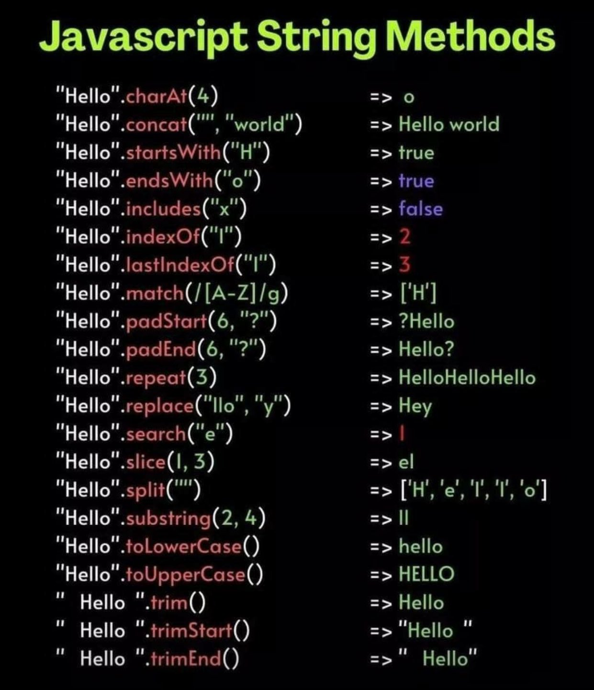

# DWEC UT02: Estructura de objetos predefinidos y objetos definidos por el usuario.

## Objetos predefinidos de tipos de datos

## String 

Una cadena (string) consta de uno o más caracteres de texto, rodeados de comillas simples o dobles; da igual cuales usemos ya que se considerará una cadena de todas formas, pero en algunos casos resulta más cómodo el uso de unas u otras.

En Javascript, es muy sencillo crear una variable de texto. A rasgos generales, hay dos formas principales de hacerlo:

| Constructor  | Descripción |
|----------|----------|
|   `new String("text")` | Crea un objeto de texto a partir del texto text pasado por parámetro. **Evitar** |
|   `"texto"` o `'texto'` | Simplemente, escribimos el texto entre comillas simples o dobles. Notación preferida. |

> La diferencia entre utilizar la palabra `new` y utilizar `string primitives`  ([enlace](https://developer.mozilla.org/en-US/docs/Web/JavaScript/Reference/Global_Objects/String#string_primitives_and_string_objects)).

Además, tambien podemos usar el `template string` haciendo uso de las comillas invertidas <code>``</code> para concatenar texto y variables.

La forma en la que se crean las cadenas en JavaScript, hace que cuando tengamos que emplear ciertos caracteres especiales en una cadena de texto, tengamos que escaparlos, empleando el símbolo `\` seguido del carácter.

```js
let personas = "Asistentes:\n * John\n * Pete\n * Mary";
console.log(personas); // a multiline list of guests, same as above
```

De esta manera podemos representar los caracteres especiales de `newLine` o `tab`, ademas de poder escribir caracteres como las comillas (tanto simples como dobles).

### Propiedades de String

Los `strings` solo tiene una propiedad (útil) y esa es la de `length`. Esta propiedad es de solo lectura y es inmutable (no se puede modificar mediante una asignación).

```js
"Hola".length;    // 4
"Adios".length;   // 5

const str = 'Life, the universe and everything. Answer:';
console.log(`${str} ${str.length}`);

let inmutable = "Cadena inmutable";
inmutable[0] = "M";
console.log(inmutable):     // Muestra "Cadena inmutable"
cadena.length = 5;
console.log(inmutable.length):     // Muestra 16
```

### Métodos de String

Pero las características más interesantes de los strings se encuentran en los métodos de dicho tipo de dato. Ten en cuenta que, en las variables de texto, los métodos se ejecutan sobre el propio texto del `string`, devolviendo información modificada a partir de este. Aquí podeis ver un resumen de los mas importantes/utilizados.

<p align="center"> 

</p>

#### *Localizando posiciones*

Existen varios métodos que permiten darnos información sobre la posición o ubicación que ocupa un determinado carácter o texto. Como ya hemos mencionado, esta posición también suele denominarse `índice`. Veamos detalladamente dichos métodos:

| Método  | Descripción |
|----------|----------|
|   ` .charAt(pos)` | Devuelve el carácter de la posición `pos`. Similar al operador `[]`. |
|   ` .at(pos)` | Igual que `charAt()` pero mas moderno, permite acceso desde atras hacia adelante con números negativos. |
|   ` .indexOf(text)` | Devuelve la primera posición del texto `text`. |
|   ` .indexOf(text, from)` | Idem al anterior, partiendo desde la posición `from`. |
|   ` .lastIndexOf(text)` | Devuelve la última posición del texto `text`. |
|   ` .lastIndexOf(text, from)` | Idem al anterior, partiendo desde `from` hacia el inicio. |

```js
const nombre = "Manolo";

// Utilizando .charAt()
nombre.charAt();        // 'M'
nombre.charAt(0);       // 'M'
nombre.charAt(1);       // 'a'
nombre.charAt(10);      // ''

// Utilizando operador []
nombre[];               // ERROR
nombre[0];              // 'M'
nombre[1];              // 'a'
nombre[10];             // undefined

//Utilizando .at()
nombre.at()             // 'M'
nombre.at(1)            // 'a'
nombre.at(5)            // 'o'
nombre.at(-5)           // 'a'
```
Ejemplo de buscar posición de caracter o `substring` (subconjunto de string) con métodos:

```js
const phrase = "LenguajeJS, página de Javascript";

phrase.indexOf("n");          // 2
phrase.indexOf("n", 3);       // 16
phrase.indexOf("n", 17);      // -1

phrase.lastIndexOf("n");      // 16
phrase.lastIndexOf("n", 3);   // 2
phrase.lastIndexOf("n", 1);   // -1
```

#### *Creando `substrings`*

| Método  | Descripción |
|----------|----------|
|   ` .substring(start, end)` | Devuelve el substring desde la posición `start` hasta `end`. |
|   ` .substr(start, size)` | Devuelve el substring desde la posición `start` hasta `start`+`size`. |
|   ` .slice(start, end)` | Idem a `.substr()` con leves diferencias. |

```js
let str = "stringify";
alert( str.slice(0, 5) ); // 'strin', el substring desde la posición 0 a la 5
alert( str.slice(0, 1) ); // 's', desde la posición 0 a la 1 (sin incluir ésta)
alert( str.slice(-4, -1) ); // 'gif', desde el final 4 posiciones atras hasta la última posición (sin incluir ésta)

alert( str.substring(2, 6) ); // "ring"
alert( str.substring(6, 2) ); // "ring", este método permite intercambiar las posiciones de 'start' y 'end' si la primera es mayor.
```

#### *Comprobando valores en `strings`*

Con estos metodos se puede comprobar si un `string` cumple alguna de las condiciones que se estan comprobando. Los métodos devuelven `true/false` en función del resultado.

| Método  | Descripción |
|----------|----------|
|   ` .includes(substr, pos)` | Comprueba si en la cadena de texto aparece `substr`. El segundo argumento es opcional e indica desde que `pos` empezar a comprobar. |
|   ` .startsWith(substr)` | Comprueba si la cadena de texto empieza con la subcadena `substr` |
|   ` .endsWith(substr)` | Comprueba si la cadena de texto termina con la subcadena `substr` |

```js
alert( "Widget with id".includes("Widget") ); // true

let saludo = "Hola Mundo!"
alert( saludo.includes("Bye") ); // false

alert( "Widget".startsWith("Wid") ); // true, "Widget" empieza "Wid"
alert( "Widget".endsWith("get") ); // true, "Widget" termina con "get"
```

#### *Dividiendo `strings`*

Un método muy útil y versátil es `.split(text)`. Permite dividir un por el substring `text` utilizándolo como separador las veces que haga falta. Como resultado, devolverá un `array` con cada una de las partes divididas. Es muy útil para crear arrays, o dividir textos que tienen separadores repetidos (comas, puntos, etc...) en varias partes:

| Método  | Descripción |
|----------|----------|
|   `  .split(text)` | Separa el texto en varias partes, usando `text` como separador |
|   `  .split(text, limit)` | Idem, pero crea como máximo `limit` fragmentos |


```js
"1.2.3.4.5".split(".");       // ["1", "2", "3", "4", "5"] (5 elementos)
"Hola a todos".split(" ");    // ["Hola", "a", "todos"] (3 elementos)
"A,B,C,D,E".split(",", 3);    // ["A", "B", "C"] (limitado a los 3 primeros elementos)

let mensaje = "Soy una persona muy feliz!";
let arr = mensaje.split(' ');

console.log(arr); // ["Soy", "una", "persona", "muy", "feliz"]
```

> Puedes encontrar más información acerca todos los métodos de objetos `string` en este enlace de MDN Mozilla ([enlace](https://developer.mozilla.org/en-US/docs/Web/JavaScript/Reference/Global_Objects/String#instance_methods)).

## Number

En JavaScript moderno, existen dos tipos de números:

* Los números normales en JavaScript se almacenan en formato de 64 bits (IEEE-754), también conocido como "números de punto flotante de doble precisión". Estos son números que usamos la mayor parte del tiempo.

* Los números `BigInt` representan números enteros de longitud arbitraria. A veces son necesarios porque un número entero normal no puede exceder con seguridad (2<sup>53</sup>-1) o ser menor que -(2<sup>53</sup>-1).

### Diferentes maneras de escribir un `number`

Se puede utilizar la barra baja (`_`) como separador visual de unidades sin afectar al propio valor. Tambien podemos añadir la letra `e` para especificar el número de ceros que aueremos

```js
let billion = 1000000000;
let billion = 1_000_000_000;

console.log(mil, mil_)      // 1000 1000

5_000_000 === 5000000;      // true

let billon = 1e9;           // 1 billón, literalmente: 1 y 9 ceros
```

Los números en hexadecimal se utilizan habitualmente en JS para la representación de colores, codificación de caracteres y otras muchas cosas. Así que, existen metodos para escribirlos de manera abreviada con `0x`, de la misma manera tenemos métodos para binario `0b` y octal `0b`.

```js
console.log(0xff)       //255
console.log(0xFF)       //255, no es sensible a mayusculas

let a = 0b11111111; // 255 en binario
let b = 0o377; // 255 en octal
console.log( a == b ); // true, es el mismo numero
```

> #### *Tener en cuenta que ...*
> Solo existe este sistema de representación para estos 3 sistemas de numeración. Para utilizar cualquier otro deberiamos utilizar `parseInt()`.

En caso de querer representar los valores numéricos en texto por alguna razón, los objetos `number` tambien tienen el método `toString()` que además nos deja representarlo en el sistema de numeración que queramos.

```js
let num = 255;

console.log( num.toString(16) );  // ff
console.log( num.toString(2) );   // 11111111
```

Internamente, un número se representa en formato de 64 bits (IEEE-754), por lo que existen exactamente 64 bits para almacenar un número: 52 de ellos se utilizan para almacenar los dígitos, 11 de ellos almacenan la posición del punto decimal y 1 bit es para la señal.

Si un número es realmente grande, puede desbordar el almacenamiento de 64 bits y convertirse en un valor numérico especial `Infinity`. Para ejemplificar los problemas de precisión veamos el siguiente ejemplo:

```js
console.log( 0.1 + 0.2 == 0.3 ); // false
```

Un número se almacena en la memoria en su forma binaria, una secuencia de bits: unos y ceros. Pero fracciones como 0,1, 0,2 que parecen simples en el sistema numérico decimal son en realidad fracciones interminables en su forma binaria.

¿Qué es 0,1? Es uno dividido por diez 1/10, un décimo. En el sistema numérico decimal, estos números son fácilmente representables. Compárelo con un tercio: 1/3. Se convierte en una fracción infinita 0,33333(3).

Por lo tanto, se garantiza que la división por potencias 10 funcionará bien en el sistema decimal, pero la división por 3 no. Por la misma razón, en el sistema de numeración binario, se garantiza que la división por potencias de 2 funciona, pero 1/10 se convierte en una fracción binaria infinita.

Simplemente no hay manera de almacenar exactamente 0,1 o exactamente 0,2 usando el sistema binario, al igual que no hay manera de almacenar un tercio como fracción decimal.

El formato numérico IEEE-754 resuelve esto redondeando al número más cercano posible. Estas reglas de redondeo normalmente no nos permiten ver esa “pequeña pérdida de precisión”, pero existe.

```js
console.log( 0.1 + 0.2 ); // 0.30000000000000004
```

La forma mas segura de solventar el problema es redondear el resultado con la ayuda del metodo `toFixed()`.

```js
let suma = 0.1 + 0.2;
console.log( suma.toFixed(2) ); // "0.30"

//Este metodo convierte el valor a un string
// Si necesitaramos conservar su valor numérico deberíamos utilizar el operador unario `+`
console.log( +suma.toFixed(2) ); // 0.3
```
#### *Comprobaciones númericas*

i queremos conocer la naturaleza de una variable numérica (número finito, número entero o número seguro), las podemos comprobar con uno de los métodos estáticos de Number que tenemos a continuación:

| Método  | Descripción |
|----------|----------|
|   ` Number.isFinite(number)` | Comprueba si `number` es un número finito |
|   ` Number.isInteger(number)` | Comprueba si `number` es un número entero |
|   ` Number.isSafeInteger(number)` | Comprueba si `number` es un número seguro |

```js
// ¿Número finito?
Number.isFinite(42);          // true
Number.isFinite(551.3);       // true
Number.isFinite(Infinity);    // false, es infinito

// ¿Número entero?
Number.isInteger(5);          // true
Number.isInteger(4.6);        // false, es decimal

// ¿Número seguro?
Number.isSafeInteger(1e15);   // true (valor en la franja verde)
Number.isSafeInteger(1e16);   // false (valor en la franja amarilla)

1e309 === Infinity;           // true
Number.isSafeInteger(1e309);  // false (valor en la franja roja)
```

> Puedes encontrar más información acerca de los métodos de `Number` en este enlace de MDN Mozilla ([enlace](https://developer.mozilla.org/en-US/docs/Web/JavaScript/Reference/Global_Objects/Number#instance_methods)).

#### *¿Que es NaN?*

El acrónimo `NaN` es un valor especial de Javascript que significa literalmente *Not A Number* (no es un número). El valor `NaN`, a pesar de su significado, se usa para representar valores numéricos (y ahora es donde viene el matiz) que son indeterminados o imposibles de representar como número.

Dentro de esa categoría hay varios:

* Indeterminación matemática: Por ejemplo, `0 / 0`.
* Valores imposibles: Por ejemplo, `4 - 'a'`, ya que es imposible restar una letra a un número.
* Operaciones con NaN: Por ejemplo, `NaN + 4`, ya que el primer operando es NaN.

```js
NaN == NaN;         // false (El valor no es el mismo)
NaN === NaN;        // false (Ni el valor, ni el tipo de dato es el mismo)

Number.isNaN(NaN);  // true (Forma correcta de comprobarlo)
Number.isNaN(5);    // false (5 es un número, no es un NaN)
Number.isNaN("A");  // false ("A" es un string, no es un NaN)
```

#### *Conversiones numéricas*

La conversión numérica usando más `+` o `Number()` es estricta. Si un valor no es exactamente un número, falla. La única excepción son los espacios al principio o al final de la cadena, ya que se ignoran.

Pero en la vida real normalmente tenemos valores en unidades, como "100px" o "12pt" en CSS. Además, en muchos países el símbolo de la moneda va después del importe, por lo que tenemos "19€" y nos gustaría extraer un valor numérico de ahí.

Para eso están `parseInt` y `parseFloat`.

"Leen" un número de una cadena hasta que ya no pueden más. En caso de error, se devuelve el número recopilado. La función `parseInt` devuelve un número entero, mientras que `parseFloat` devolverá un número de punto flotante:

```js
console.log( parseInt('100px') ); // 100
console.log( parseFloat('12.5em') ); // 12.5

console.log( parseInt('12.3') ); // 12, se devuelve la parte entera
console.log( parseFloat('12.3.4') ); // 12.3, el segundo punto detiene la conversión
```

## Math

Cuando trabajamos con Javascript, es posible realizar gran cantidad de operaciones matemáticas de forma nativa, sin necesidad de librerías externas. Para ello, haremos uso del objeto `Math`, un objeto interno de Javascript que tiene incorporadas ciertas constantes y métodos (funciones) para trabajar matemáticamente.

El objeto `Math` de Javascript incorpora varias constantes (pi, número de euler, ...) que podemos necesitar en algunas operaciones matemáticas. Aqui puedes consultarlas [enlace.](https://developer.mozilla.org/en-US/docs/Web/JavaScript/Reference/Global_Objects/Math#static_properties)

### Métodos de `Math`

Entre los muchos métodos matematicos que nos proporciona este objeto nos vamos a centrar en los más utilizados normalmente:

* Métodos de redondeo
* Métodos de aleatoriedad

### *Metodos de redondeo*

Como hemos visto anteriormente, es muy común necesitar métodos para redondear números y reducir el número de decimales o aproximar a una cifra concreta. Para ello, de forma nativa, Javascript proporciona los siguientes métodos de redondeo:

| Método  | Descripción |
|----------|----------|
|   `Math.round(x)` | Devuelve x con redondeo `(el entero más cercano)` |
|   `Math.ceil(x)` | Devuelve x con redondeo superior `(el entero más alto)` |
|   `Math.floor(x)` | Devuelve x con redondeo inferior `(el entero más bajo)` |
|   `Math.fround(x)` | Devuelve x con redondeo `(flotante con precisión simple)` |
|   `Math.trunc(x)` | Trunca el número x `(devuelve sólo la parte entera)` |

```js
// Redondeo natural, el más cercano
Math.round(3.75);           // 4
Math.round(3.25);           // 3

// Redondeo superior (el más alto)
Math.ceil(3.75);            // 4
Math.ceil(3.25);            // 4

// Redondeo inferior (el más bajo)
Math.floor(3.75);           // 3
Math.floor(3.25);           // 3

// Redondeo con precisión
Math.round(3.123456789);    // 3
Math.fround(3.123456789);   // 3.1234567165374756

// Truncado (sólo parte entera)
Math.trunc(3.75);           // 3
Math.round(-3.75);          // -4
Math.trunc(-3.75);          // -3
```

### *Metodos para aleatoriedad*

Uno de los métodos más útiles e interesantes del objeto `Math` es `Math.random()`. Este método nos da un número al azar entre los valores 0 y 1, con 16 decimales. Normalmente, cuando queremos trabajar con números aleatorios, lo que buscamos es obtener un número entero al azar entre `a` y `b`. Para ello, se suele hacer lo siguiente:

```js
// Obtenemos un número al azar entre [0, 1) con 16 decimales
let x = Math.random();

// Multiplicamos dicho número por el valor máximo que buscamos (5)
x = x * 5;

// Redondeamos inferiormente, quedándonos sólo con la parte entera
x = Math.floor(x);

// Lo mismo que lo de arriba en una sola línea
const x = Math.floor(Math.random() * 5);
```

> Puedes encontrar más información acerca de los métodos de `Math` en este enlace de MDN Mozilla ([enlace](https://developer.mozilla.org/es/docs/Web/JavaScript/Reference/Global_Objects/Math#m%C3%A9todos)).

### Date

En muchas ocasiones necesitaremos guardar o trabajar con fechas en nuestros programas. Una fecha tiene datos mixtos: día, mes y año, pero también puede ser más precisa y tener hora, minutos y/o segundos. Además, la hora puede estar en varios y múltiples formatos.

En principio, toda esta información no sería cómodo guardarla en formato de texto, ya que posteriormente nos gustaría trabajar y realizar operaciones con ellas (sumarle días, obtener el mes, obtener la hora, etc...). Así pues, tenemos un objeto llamado `Date` que nos vendrá muy bien para operaciones relacionadas con fechas.

Para crear un nuevo objeto `Date` para la fecha y hora actuales podemos utilizar la seguiente línea:

```js
let fecha = new Date();
console.log( fecha );       // muestra la fecha y hora actual
```

| Método  | Descripción |
|----------|----------|
|   `new Date()` | Obtiene la fecha del momento actual |
|   `new Date(str)` | Convierte el texto con formato `YYYY/MM/DD HH:MM:SS` a una fecha |
|   `new Date(numero)` | Convierte el número (en formato Tiempo UNIX) a una fecha UTC. |


```js
// Obtenemos la fecha actual y la guardamos en la variable date
const date = new Date();

// Obtenemos la fecha 29 de Junio de 2023, a las 23h 30m 14seg
const date = new Date("2023/06/29 23:30:14");

// Obtenemos la fecha pasando un número que representa en milisegundos el tiempo transcurrido desde el 1 de Enero de 1970
const date = new Date(872817240000);
```

#### *Obtener fechas de un `Date`*

Una vez hemos creado una fecha y tenemos el objeto , podemos trabajar muy facilmente con estas variables a través de sus sencillos métodos. Los siguientes son una lista de getters, funciones para obtener información, sobre la fecha almacenada:

| Método  | Descripción |
|----------|----------|
| `.getDay()` | Devuelve el día de la semana: OJO: 0 Domingo, 6 Sábado. |
| `.getFullYear()` | Devuelve el año con 4 cifras. |
| `.getMonth()` | Devuelve la representación interna del mes. OJO: 0 Enero - 11 Diciembre. |
| `.getDate()` | Devuelve el día del mes. |
| `.getHours()` | Devuelve la hora. OJO: Formato militar; 23 en lugar de 11. |
| `.getMinutes()` | Devuelve los minutos. |
| `.getSeconds()` | Devuelve los segundos. |
| `.getMilliseconds()` | Devuelve los milisegundos. |
| `.getTime()` | Devuelve el UNIX Timestamp: segundos transcurridos desde 1/1/1970. |
| `.getTimezoneOffset()` | Diferencia horaria (en min) de la hora local respecto a UTC (ver más adelante). |


```js
const date = new Date("2023/09/29 15:30:10");

date.getDay();            // 5 (Viernes)
date.getDate();           // 29
date.getMonth();          // 8 (Septiembre)
date.getFullYear();       // 2023
date.getHours();          // 15
date.getMinutes();        // 30
date.getSeconds();        // 10
date.getTimezoneOffset(); // -120
date.getTime();           // 1695994210000 (Tiempo Unix)
```

#### *Asignar fechas de un `Date`*

De la misma forma que en el apartado anterior podemos obtener fechas específicas, con los setters podemos modificarlas o alterarlas.

| Método  | Descripción |
|----------|----------|
| `.setFullYear(year, [month], [date])` | Altera el año de la fecha, cambiándolo por `year`. Formato de 4 dígitos. |
| `.setMonth(month, [date])` | Altera el mes de la fecha, cambiándolo por `month`. Ojo: `0-11` (Ene-Dic). |
| `.setDate(date)` | Altera el día de la fecha, cambiándolo por `date`. |
| `.setHour(hour,[min], [sec], [ms])` | Altera la hora de la fecha, cambiándola por `hour`. |
| `.setMinutes(min, [sec], [ms])` | Altera los minutos de la fecha, cambiándolos por `min`. |
| `.setSeconds(sec, [ms])` | Altera los segundos de la fecha, cambiándolos por `sec`. |
| `.setMilliseconds(ms)` | Altera los milisegundos de la fecha, cambiándolos por `ms`. |

Los metodos tienen parametros opcionales que se pueden incluir o no.

```js
let hoy = new Date();

hoy.setHours(0);
console.log(hoy);       // solo ha cambiado la hora a "0"

hoy.setHours(0, 0, 0, 0);
alert(hoy);             // cambia toda la hora a 00:00:00
```

#### *Representación de objetos`Date`*

Otro detalle más delicado dentro del trabajo con fechas es a la hora de mostrar una fecha en un formato específico. Podemos utilizar el formato por defecto que nos ofrece Javascript, pero lo más habitual es que queramos hacerlo en otro diferente, utilizando nuestra configuración horaria, abreviaturas u otros detalles.
| Método  | Descripción |
|----------|----------|
| *Formato por defecto* | `Thu Oct 05 2023 02:00:00 GMT+0200` |
| ` .toDateString()` | Devuelve formato sólo de fecha: `Thu Oct 05 2023` |
| ` .toLocaleDateString()` | Idem al anterior, pero en el formato regional actual: `5/10/2023` |
| ` .toTimeString()` | Devuelve formato sólo de hora: `02:00:00 GMT+0200` |
| ` .toLocaleTimeString()` | Idem al anterior, pero en el formato regional actual: `02:00:00` |
| ` .toISOString()` | Devuelve la fecha en el formato ISO 8601: `2023-10-05T00:00:00.000Z` |
| ` .toJSON()` | Idem al anterior, pero asegurándose que será compatible con JSON. |
| ` .toUTCString()` | Devuelve la fecha, utilizando UTC : `Thu, 05 Oct 2023 00:00:00 GMT` |

#### *Parseando una fecha desde un `string`*

El método `Date.parse()` permite leer una fecha desde un `string`. El formato de la cadena de texto debe ser el siguiente: `YYYY-MM-DDTHH:mm:ss.sssZ`:
* `YYYY-MM-DD` hace referencia al año, mes y dia.
* `T` es un caracter delimitador.
* `HH:mm:ss.sss` hace referencia a la hora ().
* El parametro opcional `Z` hace refencia a la zona horaria.

No es necesario utilizar todos los campos, si no se especifican se inicializan a cero.

Este métodos convierte el `string` en el formato especificado en un `timestamp` (número en milisegundos) de tipo `number`, que posteriormente se puede convertir a un objeto de tipo `date` facilmente

```js
let fecha = Date.parse('1972');

console.log(fecha);             // 63072000000
fecha = new Date(fecha)
console.log(fecha)              //Date Sat Jan 01 1972 01:00:00 GMT+0100 (hora estándar de Europa central)

```