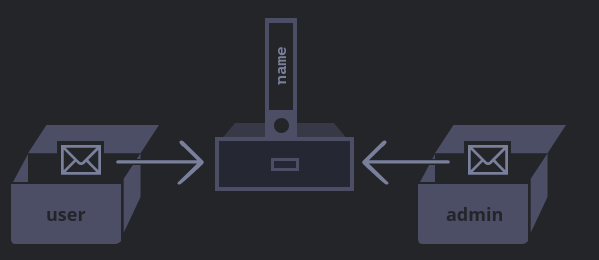

# DWEC UT02: Estructura de objetos predefinidos y objetos definidos por el usuario.

## Objetos definidos por el usuario

Ya hemos visto una pequeña introducción a los objetos al empezar el tema. Sigamos avanzando un poco y profundizando en diferentes casos de uso que le podemos dar a los objetos.

### Propiedades

Hemos visto que un objeto puede estar compuesto por `propiedades` y por `métodos`. Veamos como podemos definir las propiedades con diferentes valores en función de como instanciamos los objetos.

En muchas ocasiones utilizamos los valores de una variable para una propiedad que suele tener el mismo nombre.

```js
function crearUsuario(nombre, edad) {
  return {
    nombre: nombre,
    edad: edad,
    // ...otras propiedades
  };
}

let user = crearUsuario("John", 30);
alert(user.nombre); // John
```

Para este tipo de casos existe una abreviatura que nos permite hacer mas legible el código y reducirlo un poco.

```js
function crearUsuario(nombre, edad) {
  return {
    nombre,
    edad,
    // ...otras propiedades
  };
}
```

Como ya sabemos, una variable no puede tener un nombre igual a una de las palabras reservadas del idioma como `for`, `let`, `return`, etc. Pero para una propiedad de objeto, no existe tal restricción en cuanto a los nombres de las propiedades. Pueden ser cualquier cadena o símbolo.

Otro tipo de nombres son convertidos automaticamente, como puede ser utilizar números `int` se convierten automaticamente a un `string`.

```js
let obj = {
  0: "test" // sería lo mismo que "0": "test"
};

// ambas maneras de referirnos a la propiedad serían validas
alert( obj["0"] ); // test
alert( obj[0] ); // test 
```

Una caracteristica particular de JavaScript, en comparación con otros lenguajes de programación, es que es posible acceder a una propiedad no definida en un objeto. No devolvera ningun error al hacerlo. Leer una propiedad no definida devolvera `undefined`, de manera que podemos testear si una propiedad existe o no de manera muy sencilla.

```js
let objeto = {};
alert( objeto.prop === undefined ); // true significa que no existe

let usuario = { nombre: "John", edad: 30 };
alert( "edad" in usuario ); // true, user.edad si existe
alert( "otraCosa" in usuario ); // false, user.otraCosa no existe
```

Notese que en la parte izquierda de `in` tiene que ir el nombre de una propiedad entrecomillada `""` o `''`. De lo contraio, puede enenderse que hay una variable con el valor de una propiedad.

```js
let usuario = { nombre: "John", edad: 30 };
let clave = "nombre";
alert( clave in usuario ); // true, user.nombre si existe
```

### Iterando por las propiedades de un `object`

Como hemos visto en los `arrays` es muy interesante iterar por los elementos que lo forman. Para ello hemos visto 2 bucles parecidos, `for...in` y `for...of`, veamos como podriamos utilizarlos con objetos.

```js
let usuario = { nombre: "John", edad: 30 };

for (prop in usuario){
    console.log(prop)       // nombre 
                            // edad
}

for (prop of usuario){
    console.log(prop)       // Error: usuario is not iterable 
}
```

Esto es debido a que con el método de `for...in` no se accede al elemento en si (en este caso el elemenot consta de `clave` y `valor`), sino que se accede a la `clave`. En los `array` la clave es el indice de la posición de los elementos.

Además, en ES2015 se introducen unos métodos muy útiles para utilizar como iterador en un `object`.

| Método  | Descripción |
|----------|----------|
| `Object.keys(obj)` | Itera el `obj` y devuelve sus propiedades o **keys** |
| `Object.values(obj)` | Itera el `obj` y devuelve los **valores** de sus propiedades |
| `Object.entries(obj)` | Itera el `obj` y devuelve un con los **pares** `[key, valor]` |
| `Object.fromEntries(array)` | Construye un objeto con un array de pares `[key, valor]` |

```js
let usuario = {
    nombre: "John", 
    edad: 30, 
    altura: 187,
    saludar: function(){
        return "Hola Mundo";
    }
};

Object.keys(usuario);               // ["nombre", "edad", "altura", "saludar"]
Object.values(usuario);             // ["John", 30, 187, saludar()]
Object.entries(usuario);            // [["nombre", "John"], ["edad", 30], ["altura", 187], ["saludar", saludar()]
```

Dado que un `array` tambien es considerado un objeto, podremos utilizar estos métodos para recorrerlos.

```js
let frutas = ["Manzana", "Naranja", "Piña", "Pera", "Manzana"];

Object.keys(frutas);               // ["0", "1", "2", "3", "4"]
Object.values(frutas);             // ["Manzana", "Naranja", "Piña", "Pera", "Manzana"]
Object.entries(frutas);            // [[0, "Manzana"], [1, Naranja], [2, "Piña"], [3, "Pera"], [4, "Manzana"]]
```

El método `Object.fromEntries()` nos permite crear un objeto desde un array, a la inversa de lo que hemos visto. Para ello necesitaremos crear un array con la estructura que nos devuelve `Object.entries()`, es decir, un array bidimensional con la `clave` y el `valor` de cada propiedad.

```js
let claves = ["nombre", "edad", "altura", "saludo"];
let valores = ["John", 30, 187, function() { return "Hola Mundo!" }];

const propiedades = [];
for (let i of Object.keys(claves)) {
  const key = claves[i];
  const valor = valores[i];
  propiedades.push([key, valor]);
}

const user = Object.fromEntries(propiedades);     // {nombre: "John", edad: 30, altura: 187, saludo: valores()}
```

Veamos como podemos simplificar y compactar el código anterior con el método `.map()` anteriormente visto.

```js
let claves = ["nombre", "edad", "altura", "saludo"];
let valores = ["John", 30, 187, function() { return "Hola Mundo!" }];

let propiedades = valores.map((valor, indice) => [claves[indice], valor]);
const user = Object.fromEntries(propiedades);
```

En este caso concreto nos coinciden los nombres de las propiedaes con el valor de las propiedades en los 2 `arrays`.

### El uso de `this` en métodos

Es muy habitual que un objeto necesite acceder la información almacenada como propiedades para llevar a cabo alguna función. Por ejemplo, cuando un metodo `saludo` quiera saludar especificando el nombre del usuario.

El valor `this` representa al objeto en sí, el que se usa para llamar al método que queremos acceder.

```js
let usuario = {
  nombre: "John",
  edad: 30,
  saludo() {
    // "this" es el objeto actual
    copnsole.log(`Hola mi nombres es ${this.name}`);
  }
};
usuario.saludo(); // John
```

A diferencia de otros lenguajes de programación `this` se puede usar en cualquier función, no solo en objetos.

```js
function saludar() {
  alert( this.nombre );       // Esto no daría ningún error
}
```

El valor de `this` se evalua en tiempo de ejecución y depende del contexto. Veamoslo en un ejemplo.

```js
let usuario = { nombre: "John" };
let admin = { nombre: "Admin" };

function saludar() {
  alert( this.nombre );
}
// asignamos la misma función a 2 objetos
usuario.f = sayHi;
admin.f = sayHi;

// cada función tiene su propio contexto de "this" dentro de ella.
user.f(); // John  (this == user)
admin.['f'](); // Admin  (this == admin). Misma llamada con notación de []
```

Las funciones flecha (`arrow function`) se comportan de manera diferente a las funciones explicitas y anónimas.

```js
let usuario = {
  nombre: "John",
  saluda: () => {
    alert(this.nombre);
  }
};
usuario.saluda();       // undefined
```

A diferencia de lo que cabría esperar, éste método devuelve `undefined`.

```js
let usuario = {
  nombre: "John",
  saluda: function() {
    let arrow = () => alert(this.nombre);
    arrow();
  }
};
usuario.saluda();       // John
```

> #### *Para saber mas ...*
> Las 'arrow functions' no son solo una manera más sencilla y compacta de declarar funciones. También tienen implicaciones al respecto de los ambitos de las variables utilizadas. [Articulo.](https://somospnt.com/blog/207-funciones-flecha-vs-funciones-regulares)

### Desestructuración de `objects`

La desestructuración de objetos es, probablemente, una de las estrategias más utilizadas al trabajar en Javascript nativo (o en frameworks como React) debido a que en Javascript se utilizan muchísimo las estructuras de datos de objetos y es muy interesante simplificar lo máximo posible, así que veamos como funciona.

Veamos como podemos asignar a variables las propiedades de un `object` sencillo.

```js
const usuario = {
  nombre: "John",
  edad: 30,
  altura: 187
}

const { nombre, edad, altura } = usuario;

console.log(nombre);
console.log(edad, altura);
```

Tambien podemos renombrar los nombres de las propiedades. Además en el ejemplo volvemos a empaquetar las variables individuales en un objeto para mostrarlas en la consola.

```js
const usuario = {
  nombre: "John",
  edad: 30,
  altura: 187
}

const { nombre: name, edad: age, altura:heigh } = usuario;

console.log({name, age, heigh});
```

Ten en cuenta que, para los casos en los que una de esas propiedades no exista (o tenga un valor `undefined`), también podemos establecerle un valor por defecto como solemos hacer en los parámetros de una función.

```js
...
const { nombre = "Jackson", edad: age = 25, altura } = usuario;
....
```

Esta característica de desestructuración podemos aprovecharla a nuestro favor, para reutilizar objetos y recrear nuevos objetos a partir de otros, basándonos en objetos ya existentes, añadiéndole nuevas propiedades o incluso sobreescribiendo antiguas.

```js
const usuario = {
  nombre: "John",
  edad: 30,
  altura: 187
}

const usuarioCompleto = {
    ...usuario,
    colorPelo: "Moreno",
    colorOjos: "Azules",
    asignaturas: ["DWEC", "DWES", "DEAW", "DIW"]
}
```

### Copia y referencia a `object`

En Javascript, así como en muchos otros lenguajes, necesitaremos en ocasiones copiar o clonar elementos de nuestro código, de forma que podamos cambiar uno y dejar intacto el original. Para ello, Javascript (al igual que en otros lenguajes) tiene dos mecanismos para copiar elementos:

* Copia por **valor** (se duplica el contenido)
* Copia por **referencia** (hace referencia a donde esta el contenido)

El primero de ellos, la copia por *valor*, se realiza con los tipos de datos más básicos (los tipos de datos primitivos), es decir:`string`, `number`, `boolean`, etc. Esto ocurre así porque son estructuras simples y rápidas de copiar.

La copia por *valor* significa que simplemente se crea una nueva variable o constante y se asigna el mismo valor que tiene la variable original. Lo que a efectos prácticos cualquiera imaginaría como una copia:

```js
let message = "Hello!";
let phrase = message;
```

<p align="center"> 

</p>

El segundo mecanismo es la copia por *referencia*, y es un poco más complejo. En Javascript, como en otros lenguajes, al almacenar la información en una variable, esta se guarda en una dirección de memoria.

Con estructuras de datos más complejas como `array`, `object` u otros, esta información no se copia por valor, puesto que podríamos tener estructuras muy complejas donde pueden haber muchos niveles de profundidad (array que contiene arrays, que a su vez cada uno de ellos contienen arrays y a su vez cada uno de ellos contienen arrays...).

Para simplificar el proceso, lo que se hace con estos tipos de datos más complejos, es que la copia será una referencia al elemento original, algo que es mucho más práctico y rápido, pero con lo que hay que tener mucho cuidado.

```js
let user = { name: "John" };
let admin = user; // copia la referencia
```

<p align="center"> 

</p>

Dos objetos son iguales solamente si ellos son el mismo objeto.

Por ejemplo, aquí a y b tienen referencias al mismo objeto, por lo tanto son iguales.

```js
let a = {};
let b = a; // copia la referencia

alert( a == b ); // true, verdadero. Ambas variables hacen referencia al mismo objeto
alert( a === b ); // true
```

Y aquí dos objetos independientes no son iguales, aunque se vean iguales (ambos están vacíos).

```js
let a = {};
let b = {}; // dos objetos independientes

alert( a == b ); // false
```